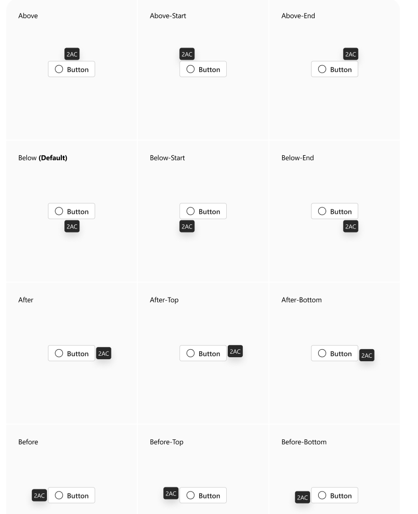
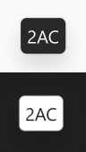

# @fluentui-contrib/react-keytips Spec

## Background

A `Keytip` is a small Tooltip near a component that indicates a key sequence that will trigger that component. There are
not to be confused with keyboard shortcuts, they are instead key sequence to traverse through levels of UI components.

## Prior Art

- [Convergence Epic](https://github.com/microsoft/fluentui/issues/31776)

### Fabric (v8)

The [Keytips](https://developer.microsoft.com/en-us/fluentui#/controls/web/keytips) is present in Fabric v8.
It provides `KeytipLayer` and `useKeytipRef` to manage the keytips.

- [KeytipLayer](https://developer.microsoft.com/en-us/fluentui#/controls/web/keytips#IKeytipLayer) - Helps to register a
  key sequence for entering and exiting from keytips, for going back to the previous level of keytips, provides necessary callbacks.
- [useKeytipRef](https://github.com/microsoft/fluentui/blob/master/packages/react/src/components/KeytipData/useKeytipRef.ts) - Creates a ref,
  which is used for passing to `Keytip` target element, handles setting necessary attributes.

```tsx
export default function App() {
  // default is 'Alt-Meta'
  return <KeytipLayer content="Alt Meta" />;
}
```

`useKeytipRef`:

```tsx
export const KeytipsRefExample = () => {
  const checkboxRef = useKeytipRef<HTMLDivElement>({
    keytipProps: {
      id: 'CheckboxKeytip',
      content: '1',
      optionalProps: {
        onExecute: (el: HTMLElement) => el.click(),
      },
    },
  });

  return <Checkbox label="checkbox" ref={checkboxRef} />;
};
```

Some Fabric components have API inherited from it's previous versions, which was based on [keytipProps](https://developer.microsoft.com/en-us/fluentui#/controls/web/keytips#IKeytipProps) with `KeytipData` being used inside the component. This approach added extra bundle size to components and was replaced in `Link`, `Toggle`, `Checkbox`, `ComboBox`, `Dropdown`, and `SpinButton` components in favour of `useKeytipRef` hook API.

```tsx
export const KeytipsButtonExample = () => {
  return (
    <CompoundButton
      text="CompoundButton"
      onClick={handleOnClick}
      keytipProps={{
        id: 'CompoundButton',
        content: '1B',
        optionalProps: {
          onExecute: (el: HTMLELement) => el.click();
        },
      }}
    />
  );
}
```

### Northstar (v0)

There is not prior implementation for this component in v0.

## Sample Code

```tsx
import { Keytips, useKeytipRef, ExecuteKeytipEventHandler } from '@fluentui-contrib/react-keytips';

const App = () => {
  const onExecute: ExecuteKeytipEventHandler = (ev, ({ targetElement })) => {
    targetElement.click();
  };

  const checkboxRef = useKeytipRef({
    keySequences: ['a'],
    content: ['A']
    onExecute,
  });

  return (
    <>
      {/* Should be added once at the top level of your app */}
      <Keytips />
      <Checkbox label="checkbox" ref={checkboxRef} />
    </>
};
```

## Variants

### Positioning Variants

The `Keytips` component using [positioning API](https://react.fluentui.dev/?path=/docs/concepts-developer-positioning-components--docs) and can be controlled by `positioning` prop in `useKeytipRef` hook.
The keytip is positioned below and centered to the target element by default.



### Style variants

`Keytips` background (`NeutralBackgroundInverted`) and foreground (`NeutralForegroundInverted`) tokens are based on theme provided to `FluentProvider`.



## API

### Keytips

| Prop Name            | Type                                   | Default     | Description                                                                                                                                      |
| -------------------- | -------------------------------------- | ----------- | ------------------------------------------------------------------------------------------------------------------------------------------------ |
| `content`            | `string`                               | `Alt Meta`  | String to put inside the `Portal`to be used for the aria-describedby for the component with the keytip. Should be one of the starting sequences. |
| `mountNode`          |                                        |             | Where the Portal children are mounted on DOM.                                                                                                    |
| `startSequence`      | `string`                               | `'alt+meta` | Key sequence that will start keytips mode.                                                                                                       |
| `returnSequence`     | `string`                               | `'escape'`  | Key sequences that execute the return functionality in keytips.                                                                                  |
| `exitSequence`       | `string`                               |             | Key sequences that will exit keytips mode.                                                                                                       |
| `onExitKeytipsMode`  | `EventHandler<OnExitKeytipsModeData>`  |             | Callback function triggered when keytip mode is exited.                                                                                          |
| `onEnterKeytipsMode` | `EventHandler<OnEnterKeytipsModeData>` |             | Callback function triggered when keytip mode is entered.                                                                                         |

## useKeytipRef

| Param          | Type                        | Default                                  | Description                                                                                                                                                       |
| -------------- | --------------------------- | ---------------------------------------- | ----------------------------------------------------------------------------------------------------------------------------------------------------------------- |
| `positioning`  | `PositioningProps`          | `{ align: 'center', position: 'below' }` | Positioning props to be passed to Keytip.                                                                                                                         |
| `onExecute`    | `ExecuteKeytipEventHandler` |                                          | Callback function triggered when keytip is activated.                                                                                                             |
| `onReturn`     | `ReturnKeytipEventHandler`  |                                          | Callback function triggered when the return sequence is pressed.                                                                                                  |
| `keySequences` | `string[]`                  |                                          | Array of KeySequences which is the full key sequence to trigger this keytip. Should not include initial 'start' key sequence.                                     |
| `dynamic`      | `boolean`                   |                                          | Whether or not this keytip will have dynamic content: children keytips that are dynamically created (DOM is generated on keytip activation), Menu, Tabs or Modal. |
| `visible`      | `boolean`                   | `false`                                  | Control the Keytip's visibility programmatically.                                                                                                                 |
| `content`      | `string`                    |                                          | The text content of the Keytip.                                                                                                                                   |

## Structure

### JSX Tree

```tsx
<Portal>
  <Keytip content="A" positioning={{ target1 }} />
  <Keytip content="B" positioning={{ target2 }} />
  <Keytip content="C" positioning={{ target3 }} />
</Portal>
```

### DOM

```html
<!-- Portal from Keytips -->
<div>
  <div role="tooltip" id="tooltip-1" class="{tooltip}" data-popper-placement="bottom">A</div>
  <div role="tooltip" id="tooltip-2" class="{tooltip}" data-popper-placement="bottom">B</div>
  <div role="tooltip" id="tooltip-3" class="{tooltip}" data-popper-placement="bottom">C</div>
</div>
```

## Migration

See [MIGRATION.md](./MIGRATION.md).

## Behaviors

## Entering and Exiting Keytips Mode

- When the `startSequence` is pressed, the keytips component will enter keytips mode. By default the `startSequence` is `'alt+meta'` (option+control on macOS).
  After entering keytips mode, the root Keytips will be visible (the ones that have no parent Keytip).

- When the `returnSequence` is pressed, the parent keytips of current keytip will be shown, if it's the first (root) level of keytip, then the keytips mode will be exited.

- When the `exitSequence` is pressed, the keytips mode will be exited. It's also possible to exit keytips mode by pressing the `startSequence` again, or by
  mouse click outside of the keytips. It's also exiting from keytips mode on resize of the window or scroll.

## Keytip activation

- `Keytip` activation is done by pressing the key sequence that is defined in `keySequences` prop of `useKeytipRef` hook.
  When the key sequence is pressed, the `onExecute` callback is triggered, if keytip has children keytips it will show them.

- `Keytip` sequence is case-insensitive and limited to 3 characters.

## Keytip on disabled item

- Unlike Fabric, the `Keytip` won't appear for disabled target.

## Keytip positioning

`Keytip` component using [positioning API](https://react.fluentui.dev/?path=/docs/concepts-developer-positioning-components--docs) and
can be controlled by `positioning` prop in `useKeytipRef` hook. By default all keytips are positioned below and centered to the target element.

## Keytip and dynamic content

There is a special case where controls on the page will change other controls down the chain in the `keytip` sequence.
For instance, clicking Button A and Button B will update the text of the Button C. Keytip sequence of Button C is depending on Button A and B,
because it cannot be the child of both at the same time, for this working fully Button A and Button B should have set their keytips with additional
parameter `dynamic: true`.

```tsx
const [currentButton, setCurrentButton] = React.useState('Button 1');
const startSequence = currentButton === 'Button 1' ? 'gg1' : 'gg2';

const onExecute: ExecuteKeytipEventHandler = (_, { targetElement }) => {
  if (targetElement) targetElement?.click();
};

const firstButton = useKeytipRef({
  keySequences: ['gg1'],
  content: 'GG1',
  dynamic: true,
  onExecute,
});

const secondButton = useKeytipRef({
  keySequences: ['gg2'],
  content: 'GG2',
  dynamic: true,
  onExecute,
});

const thirdButton = useKeytipRef({
  content: 'GG3',
  keySequences: [startSequence, 'gg3'],
});
```

## Accessibility

In terms of accessibility, `Keytip` component is very similar to `Tooltip` - it's a small popup that displays information related to an element, with difference, that `Keytip` can't be displayed by mouse hover over target element. Multiple keytips can be visible at the same time.

- Each `Keytip` is assigned the role `"tooltip"`.
- The `Keytip` target element references the corresponding keytip element using the `"aria-describedby"` attribute, providing a clear association between the target and the keytip (tooltip).
- `Keytips` component has `content` prop, which is responsible for adding the `"aria-describedby"` for default start key sequence.
- `Keytip` is not focusable.
- `Keytip` adds `"aria-keyshortcuts"` attribute to the target element, which contains the key sequence that will trigger the keytip.
- Unlike Tooltip, pressing `Escape` does not always hide the `Keytip`. By default, `Keytip` is configured to use `Escape` as a return sequence. Therefore, if there are ancestor keytips, pressing it will not hide the current `Keytip` but will instead display the ancestor keytips.
- Focus stays on the trigger element while `Keytip` is displayed.
