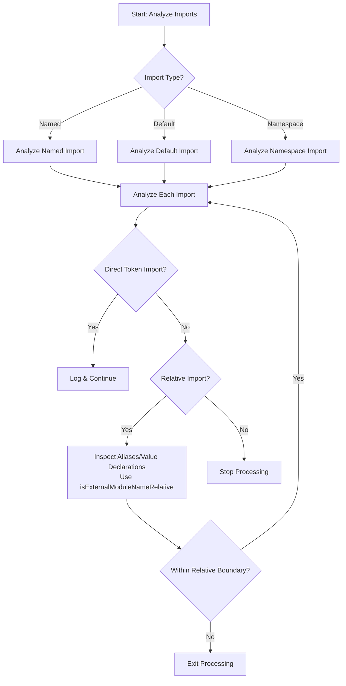

- analyze imports
- split into 3 paths to analyze named, default and namespace imports
- converge back to same path and analyze each import
- determine if it's a direct import of a token, if it is, log it and move on
- if it's not a direct token import, but is relative, we should analyze any aliases or value delcarations. We can also use `isExternalModuleNameRelative` to figure out if we should keep digging for aliases. So even if, for some reason, we have an alias but it's past the relative boundary, we can exit processing. We shouldn't dig into modules here.
- if it's not a direct token import, and is not relative, we know we've hit a boundary and can stop processing.

